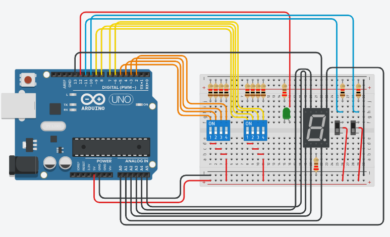

# 4 Bit ALU Hex Display Tinkercad

This project works with the representation of a low level machine in 1 bit. The levels of organization of the computer system are presented from the electronic and digital logic to the user. 

The code made available in this repository creates a program that imitates the operation of the lowest levels of a computer's organization, which would be an **ALU (arithmetic logical unit)**, a component of the computer responsible for the calculations performed by the machine.

[what are the levels of computer system organization?](https://www.tutorialspoint.com/what-are-the-levels-of-computer-system-organization)


The **.ino** code available in this repository simulates the operation of an **ALU** with 4 operations: AND (&&), NOT B (~B), OR (|) or Add (A+B).
The code uses the output result of the operation performed by the ALU (call this output "S") to print on the 7-segment Display. Through the Karnaugh map, we can use the "S" output and perform Boolean operations to activate or deactivate each segment of the display. 

# [Binary/hexadecimal decoder using 7-segment display and Arduino (video in Brazilian Portuguese)](https://www.youtube.com/watch?v=uicrqOhSp2Q)

This link above is to a video that shows a code used as a base in to do the functions of converting bits into a hexadecimal output. 

This repository code used as a basis the construction of the prototype shown in the link, working knowledge of an ALU and low-level machines, through **computer organization** classes of the curricular component of the **Computer Science** course.

# Concepts and Tables

This project works with inputs A and B that have 4 bits and provide a 4-bit output plus an overflow if there is any addition involved.

With 4 bits we have a total of 16 combinations. The hexadecimal system can make a numerical representation of these bits.
let's see the table below:

| Binary      | Decimal | Hexadecimal |
| ----------- | ------- | ----------- |
|     0000    | 0       | **0x00**    |
|     0001    | 1       | **0x01**    |
|     0010    | 2       | **0x02**    |
|     0011    | 3       | **0x03**    |
|     0100    | 4       | **0x04**    |
|     0101    | 5       | **0x05**    |
|     0110    | 6       | **0x06**    |
|     0111    | 7       | **0x07**    |
|     1000    | 8       | **0x08**    |
|     1001    | 9       | **0x09**    |
|     1010    | 10      | **0x0A**    |
|     1011    | 11      | **0x0B**    |
|     1100    | 12      | **0x0C**    |
|     1101    | 13      | **0x0D**    |
|     1110    | 14      | **0x0E**    |
|     1111    | 15      | **0x0F**    |

As the ALU does the sum of bits we need to know how to add two bits. We need to understand how the binary system works, for example: 

```
Sum of binaries
1 + 1
``` 

The binary system only goes up to 1, so 1 + 1 couldn't be 2. So the result will be 0 and carry 1 to the next one, let's see that now:

|Carry     | |1| |
| -------- |-|-|-|
|A         | | |1|
|B         |+| |1|
|**Result**| |1|0|

For you to visualize let's add using the decimal system to understand better:

|Carry     | |1| |
| -------- |-|-|-|
|numberA   | | |5|
|numberB   |+| |5|
|**Result**| |1|0|

To better understand the sum of binary values, let's see the truth table of the sum of bits A and B.

| A | B | Cin | Sum | Cout |
| - | - | --- | --- | ---- |
| 0 | 0 | 0   | 0   | 0    |
| 0 | 0 | 1   | 1   | 0    |
| 0 | 1 | 0   | 1   | 0    |
| 0 | 1 | 1   | 0   | 1    |
| 1 | 0 | 0   | 1   | 0    |
| 1 | 0 | 1   | 0   | 1    |
| 1 | 1 | 0   | 0   | 1    |
| 1 | 1 | 1   | 1   | 1    |


# Project

You can download this project and use the .ino code or copy from txt, cpp or ino file. 

To assemble the prototype on the arduino you need the following items: 

## Itens
- 12 resistors.
- 2 of 220 ohm and the rest of 1 k ohm.
- 31 jumpers or wires. 
- 2 DIP switches DPST x 4. 
- 1 led. 
- 1 arduino UNO. 
- 2 slide switches.
- 1 Common anode 7-segment Display 

Below you can see the schematic assembled in tinkercad. 

### Obs: 
Do the assembly using the same pins, because inside the code the first 13 pins are initialized in a list starting from digital pin 2 to be of **INPUT** type.

``` C++
for (int i = 0; i < 13; i++){
    pins[i] = i;
    pinMode(pins[i], INPUT);
}
```

### TinkerCad Image
[ALU4bits7segmentsHexConverter](https://www.tinkercad.com/things/alrqUc2yDrl)


